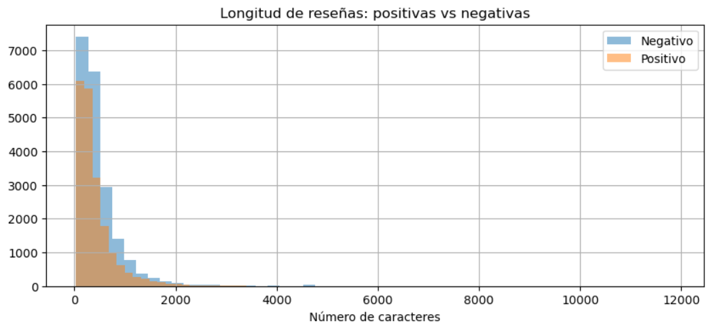
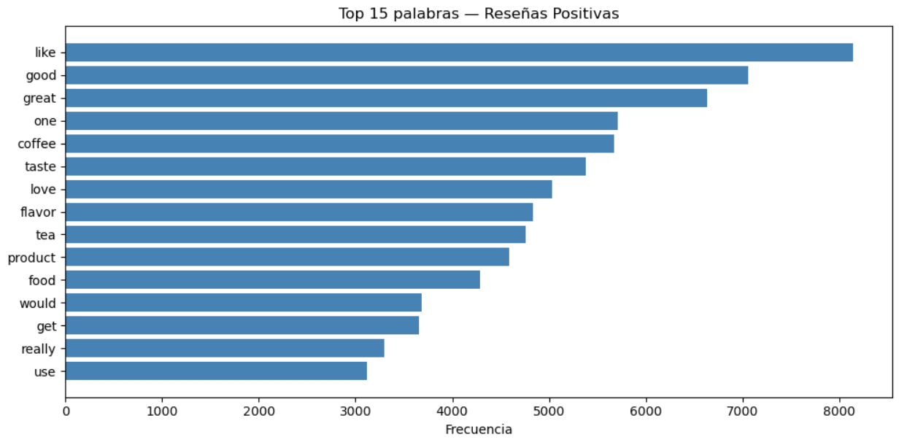
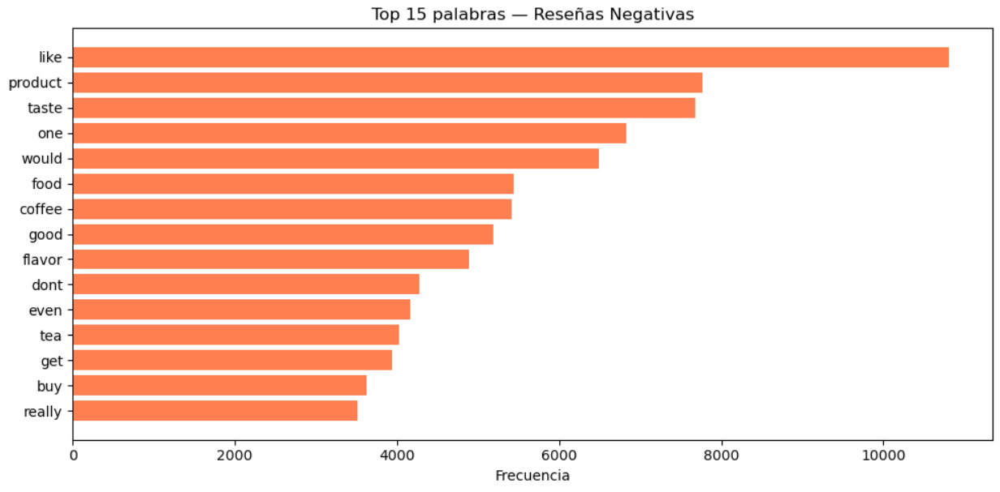
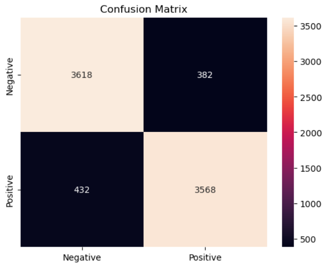
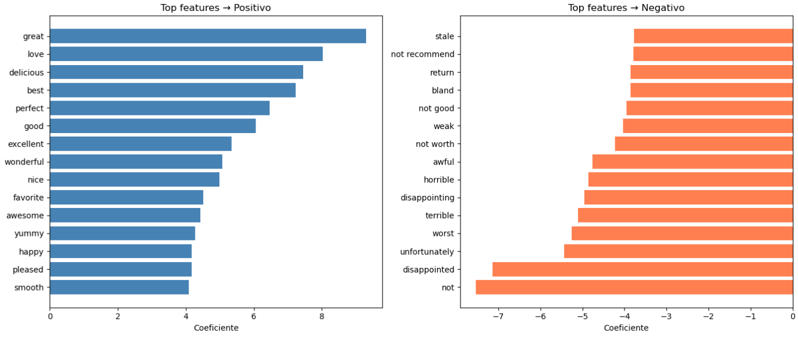

# 🛍️ Amazon Sentiment Analysis — NLP Classifier


## Planteamiento del problema
Amazon recibe millones de reseñas de productos a diario. Ningún equipo humano 
puede leerlas todas. Este proyecto desarrolla un clasificador de NLP que 
identifica automáticamente si una reseña es positiva o negativa, 
lo que permite a las empresas actuar con rapidez: corregir productos, responder 
a las quejas e identificar qué funciona.

## Contexto empresarial
Las reseñas de clientes son una de las señales más valiosas que tiene una empresa 
retail. Una sola tendencia negativa detectada a tiempo puede prevenir la pérdida 
de ingresos y proteger la reputación de la marca. Automatizar el análisis de 
sentimiento a gran escala convierte el texto no estructurado en información 
empresarial útil.

## Dataset
Fuente: [Kaggle — Amazon Product Reviews](https://www.kaggle.com/datasets/snap/amazon-fine-food-reviews)

- 568.454 reseñas en múltiples categorías de productos
- Score: 1–5 estrellas (convertidas a etiquetas positivas/negativas)
- Columnas clave: `Text` (review body), `Score`, `Summary`

## Metodología

### 1. Preparación de datos y equilibrio de clases
- Se convirtieron las puntuaciones de 1 a 5 estrellas en etiquetas binarias:
positivas (≥4 estrellas) y negativas (≤2 estrellas)
- Se aplicó un muestreo estratificado: 20 000 reseñas por clase
para eliminar el sesgo por desequilibrio de clases

### 2. Análisis exploratorio de datos (EDA)
Hallazgos clave:
- 📏 Las reseñas negativas son, en promedio, 69 caracteres más largas
que las positivas: los clientes frustrados escriben más.
- 🔤 Palabras como "gustar" y "sabor" aparecen en ambas categorías,
lo que las convierte en indicadores de sentimiento deficientes.
- ❌ Hallazgo crítico: la eliminación estándar de palabras vacías elimina
"no", "nunca", "no", destruyendo el contexto de negación.





### 3. Proceso de preprocesamiento de texto
```python
clean_text(review):
    1. Lowercase
    2. Remove punctuation and numbers
    3. Tokenize
    4. Remove stopwords (preserving: not, never, no, nor)
    5. Lemmatize with WordNetLemmatizer
```

### 4. Vectorización
Se utilizó **TF-IDF** con bigramas (`ngram_range=(1,2)`, `max_features=10,000`).
Los bigramas capturan frases de dos palabras como «no es bueno» o «muy recomendable» 
como unidades individuales, lo cual es fundamental para la detección de sentimientos.

### 5. Comparación de modelos

| Model | F1 Score | Speed | Handles negation |
|-------|----------|-------|-----------------|
| TF-IDF + Logistic Regression | 0.90 | Fast | Partial ✅ |
| BERT (pretrained) | 0.84* | Slow | Full ✅ |

*Evaluado con 100 muestras, BERT tendría un mejor rendimiento con un conjunto de evaluación más grande.

### 6. Hallazgos clave
- **Problema de negación**: "NOT light" → TF-IDF pierde la negación
  sin un manejo personalizado de palabras vacías
- **Ventaja de BERT**: 99,97 % de confianza en "NOT light" como
  negativa: lee el contexto completo de la oración
- **Compensación**: TF-IDF está listo para producción en cuanto a velocidad y escalabilidad;
  BERT es superior para revisiones ambiguas o con mucho contexto

## Resultados
- **F1 Score: 0.90** (equilibrada entre positivo y negativo)
- Precision: 0.89–0.90 | Recall: 0.89–0.90
- La matriz de confusión muestra una baja tasa de clasificación errónea en ambas clases.




## Limitaciones y mejoras futuras
- La evaluación de BERT se limitó a 100 muestras debido al costo computacional.
- El manejo de negaciones podría mejorarse con el etiquetado de partes de la oración.
- Se excluyeron las reseñas neutrales (3 estrellas); un modelo de 3 clases
  añadiría complejidad, pero ofrecería una mejor cobertura en el mundo real.

## Cómo reproducir
```bash
git clone https://github.com/Rademirac/amazon-sentiment-analysis
cd amazon-sentiment-analysis
pip install -r requirements.txt
```
Download dataset from Kaggle and place `Reviews.csv` in `/data`.

## Tech stack
`Python` `Pandas` `NLTK` `Scikit-learn` `TF-IDF` `Logistic Regression`
`HuggingFace Transformers` `BERT` `Matplotlib` `Seaborn`